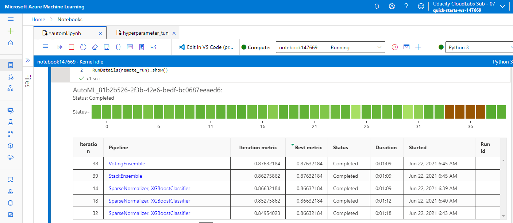
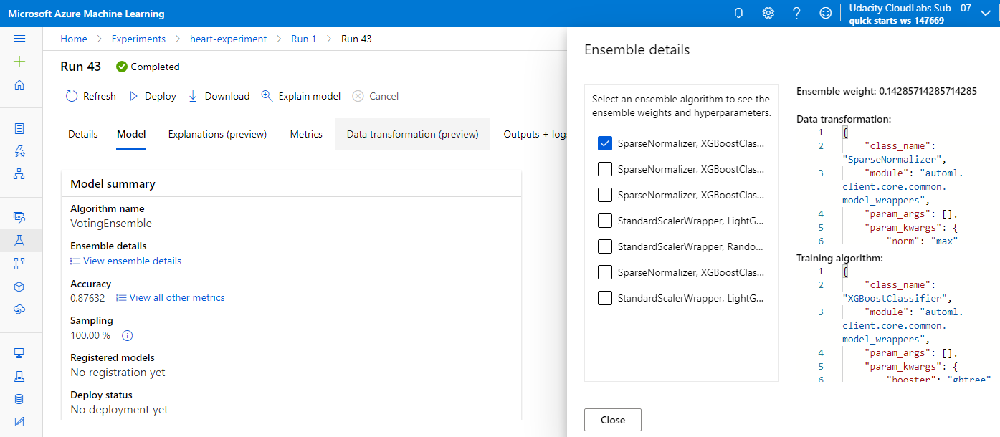
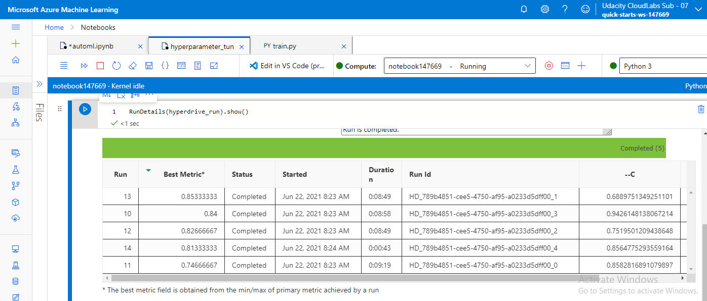
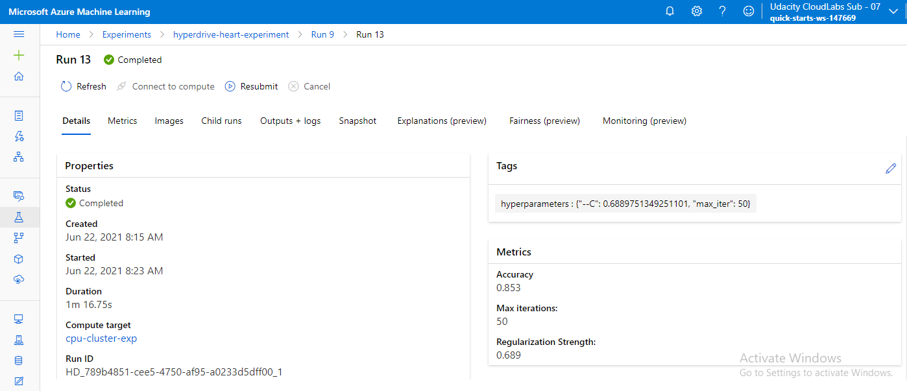
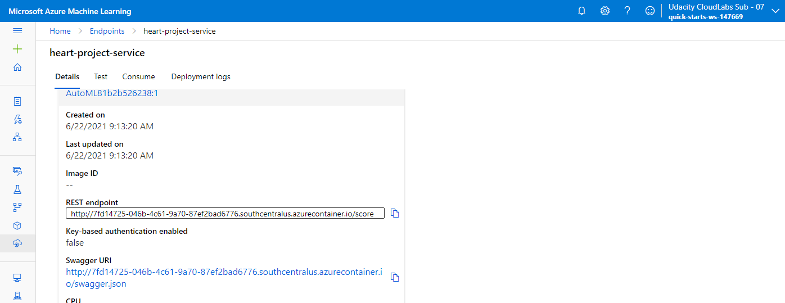
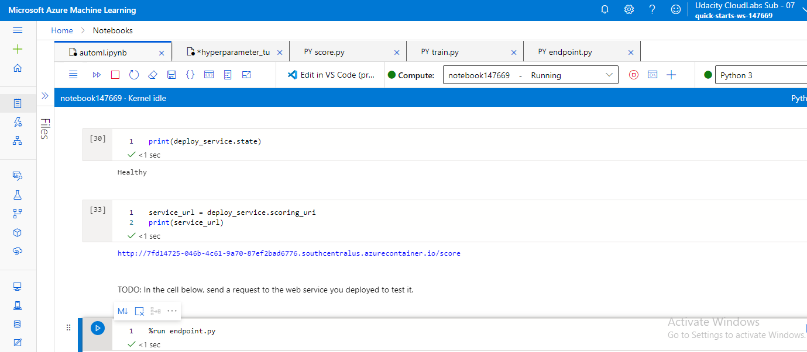
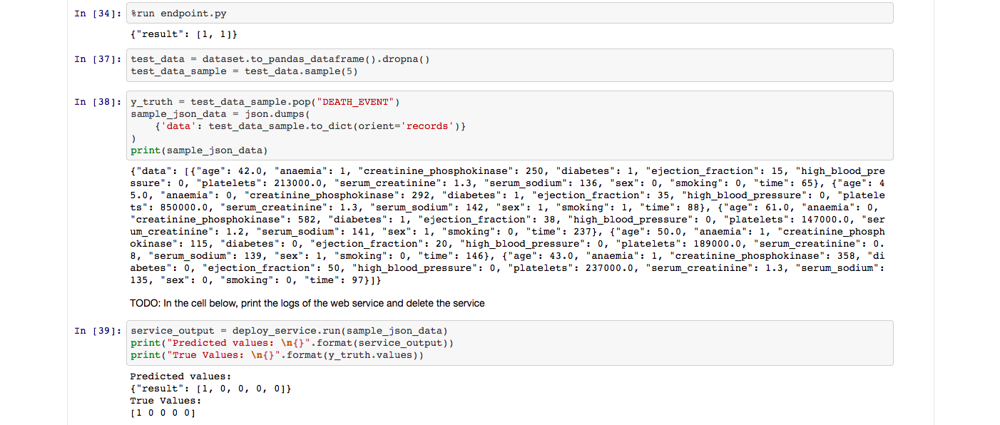
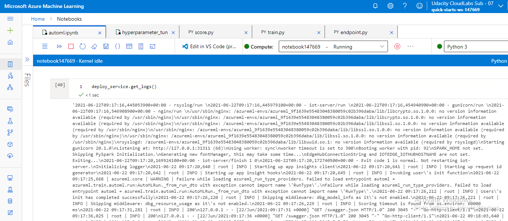

# Azure ML Project - Predicting Heart Failure 

This project demonstrates the ability to use an external dataset in Azure ML workspace, train a model using the different tools available in the AzureML framework as well as the ability to deploy the model as a web service.

I will be using two approaches to find the solution:

1) Train a model using AutoML
2) Train a model using Hyperdrive

I will then deploy the best model as a webservice and test it by sending a request to the model endpoint.

## Project Set Up and Installation

This project has been implemented in Azure ML.

1) First you need to setup a workplace in Azure ML Studio.

2) Then create a compute instance VM to run jupyter notebooks.

3) You can then install some starter files for following some steps for running an experiment using AutoML and Hyperdrive:
https://github.com/udacity/nd00333-capstone/tree/master/starter_file

4) Then you can proceed to select the dataset of your own choice. Here, following dataset was chosen from Kaggle:
https://www.kaggle.com/andrewmvd/heart-failure-clinical-data

5) Select the best performing model (AutoML or Hyperdrive) and deploy it.

## Dataset

### Overview

I will be using Heart Failure Prediction dataset from Kaggle:
https://www.kaggle.com/andrewmvd/heart-failure-clinical-data

Heart failure is a common event caused by Cardiovascular diseases (CVDs) and this dataset contains 12 features that can be used to predict mortality by heart failure. 

Machine learning models can be of great importance for early detection and management for people with cardiovascular disease or who are at high cardiovascular risk (due to the presence of one or more risk factors such as hypertension, diabetes, hyperlipidaemia or already established disease).

### Task

It's a classificaiton task. We will be predicting a death event by heart failure when given 12 features as an input.

In total, the dataset has 299 samples.

Following are the 12 features we will be using as an input for our ML models:

1) age
2) anaemia - Decrease of red blood cells or hemoglobin (boolean)
3) creatinine_phosphokinase - Level of the CPK enzyme in the blood (mcg/L)
4) diabetes - If the patient has diabetes (boolean)
5) ejection_fraction - Percentage of blood leaving the heart at each contraction (percentage)
6) high_blood_pressure - If the patient has hypertension (boolean)
7) platelets - Platelets in the blood (kiloplatelets/mL)
8) serum_creatinine - Level of serum creatinine in the blood (mg/dL)
9) serum_sodium - Level of serum sodium in the blood (mEq/L)
10) sex - Woman or man (binary)
11) smoking - If the patient smokes or not (boolean)
12) time - Follow-up period (days)

Our task will be to predict Death Event - If the patient deceased during the follow-up period (boolean)

### Access

First, I downloaded the dataset from Kaggle. Then I uploaded it on my github project repo to access it.

Following is the code sample of how I accessed the data in my workspace.

```
key = "Heart-failure"
description_text = "Heart Failure Prediction DataSet from Kaggle"

# Create AML Dataset and register it into Workspace
example_data = 'https://raw.githubusercontent.com/santosh-gatech/nd00333-capstone/master/starter_file/heart_failure_clinical_records_dataset.csv'
dataset = Dataset.Tabular.from_delimited_files(example_data)        

# Register Dataset in Workspace
dataset = dataset.register(workspace=ws,
                           name=key,
                           description=description_text)
```

## Automated ML

Following is the code sample for my automl settings and configuration:

One thing to note in the automl settings is that the primary metric I chose to improve was the "accuracy" of the model. The experiment_timeout_settings was set 20 minutes and max_concurrent_iterations to 5 considering the resources. All the other automl settings were kept to default value.

In automl cofiguration file, I set the task as "classification" for predicting "DEATH_EVENT". I also enabled early stopping.

```
automl_settings = {
    "experiment_timeout_minutes": 20,
    "max_concurrent_iterations": 5,
    "primary_metric" : 'accuracy'
}

automl_config = AutoMLConfig(compute_target=compute_target,
                             task = "classification",
                             training_data=dataset,
                             label_column_name="DEATH_EVENT",
                             enable_early_stopping= True,
                             featurization= 'auto',
                             debug_log = "automl_errors.log",
                             **automl_settings
                            )
```

### Results

Following is the screenshot of `RunDetails` widget:



The best Auto ML model was the VotingEnsemble model with an accuracy of 87.63%

The ensemble models uses the weighted averages of models already been trained. In current case, the best VotingEnsemble model was weighted average of 7 different models.

Each of these 7 models were a combination of:

1) one training algorithm (XGBoostClassifier, LightGBM, Random Forest) and
2) one data transformation technique (Sparse Normalizer, Standard Scaler wrapper).




## Hyperparameter Tuning

A Scikit-learn Logistic Regression model was trained whose hyperparameters were tuned using HyperDrive.

Following were the two parameters tuned:

1) regularization strength (C)
2) maximum number of iterations (max_iter)

Hyperdrive was used to identify the best hyperparameters since it randomly draws parameter from the available options and continues until it hits its early stopping policy or runs out of options.

Random Parameter Sampling was used because it is much less time consuming and the accuracy obtained is comparable to other parameter sampling techniques (like Grid Sampling).

The regularization strength (C) was uniformly chosen between 0.5 and 1 and maximum number of iterations were randomly selected between 50 and 100.

Bandit Policy was used for early stopping. It is based on evaluation interval and slack factor. Bandit policy only keeps the best performing runs that are within the allowed slack factor and automatically terminate runs that are not producing good results.

### Results

Following is the screenshot of `RunDetails` widget:



The best Hyperdrive model had an accuracy of 85.33%

From below, we can see the best parameters of the model were:
1) regularization strength (C) = 0.689
2) maximum number of iterations (max_iter) = 50



## Model Deployment

The best performing model was the VotingEnsemble model which was obtained from Azure AutoML approach with an accuracy of 87.63%.

I deployed the above model in following way:

1) First I register the model and get the environment
```
# Register model

ml_model = remote_run.register_model(
    model_name=model_name,
    description='Best AutoML model' 
)

env = best_model.get_environment()
```

2) Then create the inference config with application insights enabled
```
infer_config = InferenceConfig(entry_script='score.py', environment=env)
service_config = AciWebservice.deploy_configuration(
    cpu_cores=1,
    memory_gb=1,
    enable_app_insights=True
)
```

3) And deploy the model
```
service_name = 'heart-project-service'

deploy_service = Model.deploy(
    ws,
    service_name,
    [ml_model],
    infer_config,
    service_config
)

deploy_service.wait_for_deployment(show_output=True)
```



After confirming that the endpoint is healthy, I send a request to the service via `endpoint.py` script which sends 2 input data requests.  



In the below image, we can see the results when `endpoint.py` script is executed. We get 2 outputs as expected. 

Also, you can observe that I tested the deployed service by submitting 5 input data samples in another way. We can observe that for the 5 input samples, the predicted values were same as truth values.



Below you can also see the logs for the service:



## Future Work

I would also like to try different primary target metric like AUC, or f1-score to see the robustness of the model. 

We can observe that the best model accuracy is still below 90%. So there is a lot of scope to improve the accuracy. 

One approach to improve accuracy is to try different data augmentation techniques. 

Also, feature engineering might also play a important role in improving the model.

Deep learning architectures are one of the best ML models for classification task but the only problem is that these architectures are data hungry. If the training data can be successfully increased by data augmentation techniques, it would be very helpful. 

## Screen Recording

https://youtu.be/WTB592d4Kts
